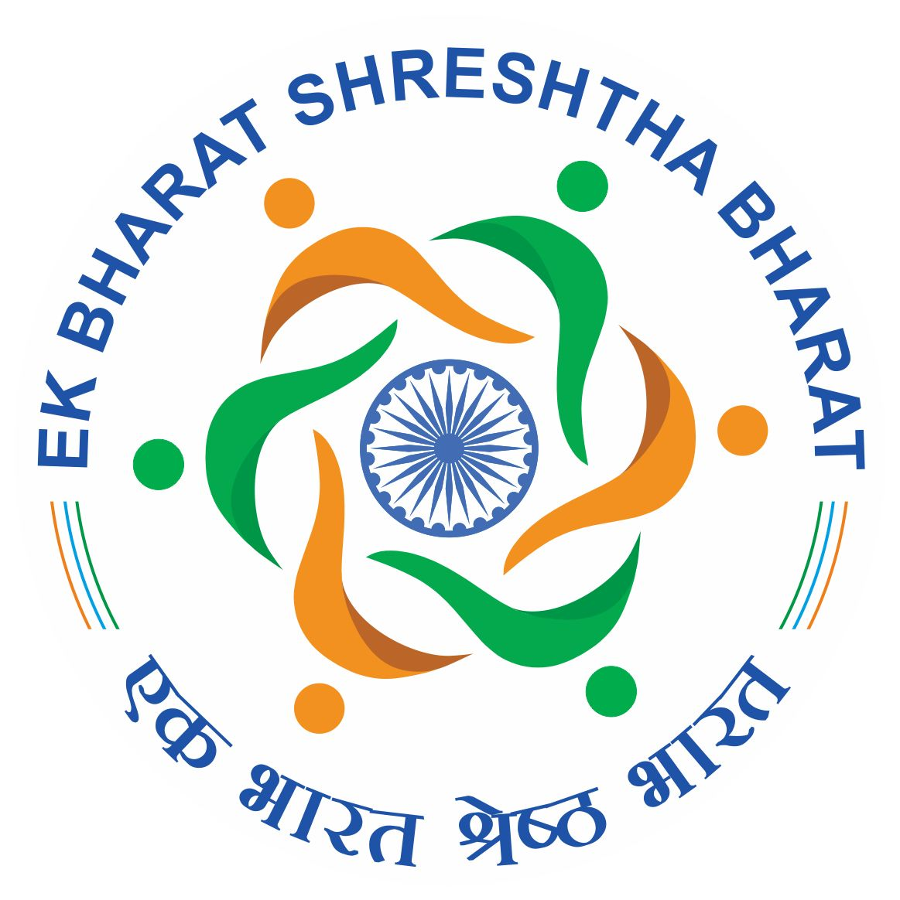

<div align="center">
  
  
</div>

<h1 align="center">Ek Bharat Shreshtha Bharat (EBSB) Website</h1>
<h3 align="center">Indian Institute of Technology (IIT) Jammu</h3>

<div align="center">
  <br />
  <a href="#about-the-project"><strong>Explore the Docs »</strong></a>
  <br />
  <br />
  <a href="https://Princu-Babu.github.io/ebsb-website">View Live Website</a>
  ·
  <a href="https://github.com/Princu-Babu/ebsb-website/issues">Report Bug</a>
  ·
  <a href="https://github.com/Princu-Babu/ebsb-website/issues">Request Feature</a>
</div>

<br />

## 🌟 About The Project

Welcome to the official web portal for the **Ek Bharat Shreshtha Bharat (EBSB) Club** at **IIT Jammu**. 

The **Ek Bharat Shreshtha Bharat** initiative was launched by the Government of India to enhance understanding and bonding between the states, thereby strengthening the unity and integrity of India. Our club at IIT Jammu embraces this vision by organizing cultural exchanges, festivals, technical showcases, and social awareness programs.

This website serves as the central hub for:
*   Showcasing our **cultural events** (Pongal, Ugadi, Janmashtami, and more!)
*   Introducing our **Core Team** and Faculty Advisors
*   Providing a **Gallery** and **Blog** to celebrate our heritage and student activities
*   Highlighting our students' outstanding **Achievements**

### 🎨 Design Philosophy

The website is designed with a modern, glassmorphic aesthetic while staying deeply rooted in Indian culture. Our color palette features vibrant **Saffron, White, Green, and Navy Blue**, evoking a sense of patriotism and modern elegance.

---

## 🏗️ Project Structure

*   🏠 **Home (`index.html`)**: Landing page highlighting recent milestones and the club's core vision.
*   📖 **About Us (`about.html`)**: The mission and vision behind EBSB at IIT Jammu.
*   👥 **Team (`team.html`)**: Profiles of our coordinators, core team heads, and faculty.
*   🎉 **Events (`events.html`)**: Detailed records of our past and upcoming events, beautifully presented in interactive cards and modals.
*   📸 **Gallery (`gallery.html`)**: A masonry-style visual showcase featuring advanced category filtering.
*   📝 **Blog (`blog.html`)**: Articles, reflections, and insights from our students.
*   🏆 **Achievements (`achievements.html`)**: Celebrating the success of our students on a national level.
*   📞 **Contact (`contact.html`)**: Ways to get in touch with the team.

---

## 💻 Built With

This project relies on a lightweight, lightning-fast static stack to ensure maximum compatibility and zero server overhead:

*    
*    (Custom Vanilla CSS, CSS Grid, Flexbox)
*    (Vanilla JS for interactive modals and filtering)
*    

---

## 🚀 Getting Started

To get a local copy up and running, follow these simple steps.

### Prerequisites
You only need a modern web browser. No complex package managers or servers required!

### Installation
1. Clone the repo:
   ```sh
   git clone https://github.com/Princu-Babu/ebsb-website.git
   ```
2. Navigate to the project directory:
   ```sh
   cd ebsb-website
   ```
3. Open `index.html` in your favorite browser. 
   *(Optional but recommended: Use a local server like the **Live Server** extension in VS Code for the best experience).*

---

## 🛡️ Security Policy

Because this is a **100% static website** containing only HTML, CSS, and Client-Side JS, there is **no backend server, no database, and no sensitive user data stored.** This inherently makes the website incredibly secure against traditional vulnerabilities like SQL Injections or DDoS attacks.

Please review our [Security Policy](.github/SECURITY.md) for more details.

---

## 🤝 Contributing

Contributions are what make the open-source community such an amazing place to learn, inspire, and create. Any contributions you make are **greatly appreciated**.

If you are an IIT Jammu student and want to contribute:
1. Fork the Project
2. Create your Feature Branch (`git checkout -b feature/AmazingFeature`)
3. Commit your Changes (`git commit -m 'Add some AmazingFeature'`)
4. Push to the Branch (`git push origin feature/AmazingFeature`)
5. Open a Pull Request

---

<div align="center">
  <p>Crafted with ❤️ by the students of IIT Jammu.</p>
</div>
